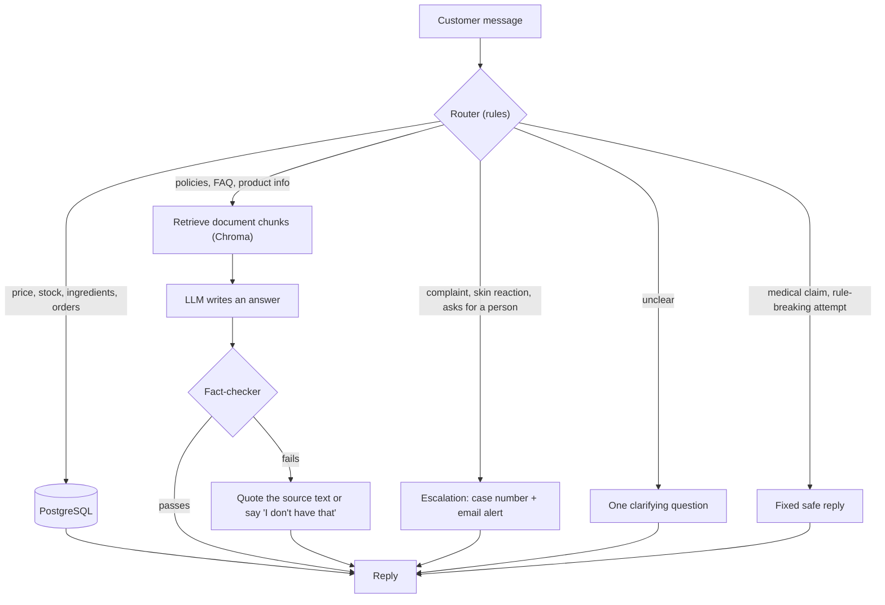

# GlowCare AI Support Agent

An AI customer-support agent for small businesses, demonstrated on a fictional skincare brand, GlowCare. Customers chat in a WhatsApp-style window in English or Roman Urdu. The agent answers from real data, hands over to a person when it should, and says so plainly when it doesn't know something.

All company, product, order and customer data in this repository is made up.

**[Watch the demo video](https://www.loom.com/share/ee19f97e45214f30bcea5e5830561906)**

## What it does

| Customer asks | What happens |
|---|---|
| "What's in the Hydra Balance Moisturizer?" | The ingredient list is read from PostgreSQL. The LLM never supplies prices, stock or ingredients. |
| "Where is my order GC10241?" | Exact order lookup. With no order number it asks for one; with an unknown number it says it can't find the order. |
| "Can I return a product after opening it?" | Answered from the policy documents (RAG) and fact-checked against them before the customer sees it. |
| "I got a rash after using the cleanser" | Handed to a person straight away, with a case number (`ESC-7`) and an email alert to the team. |
| "Will this cure my acne?" | Refused with a safe reply. No medical claims. |
| "What's the weather today?" / "Are you a bot?" | Answered politely without opening a support case - it's not a support question. |
| "How much does it cost?" (no product) | Asks which product instead of guessing. |
| "niacinamide serum ka price kitna hai?" | Understood and answered in Roman Urdu. |

It also remembers the last few messages for follow-ups ("how much is it?", "and the sunscreen?"), has quick-reply buttons in the chat page, and comes with an admin dashboard for the business team.

## How it works



The LLM never states a business fact on its own. Prices, stock and order status come from the database. Policies and product information come from the documents in `data/`. The LLM decides how to word an answer, not what is true. The full rule set is in [`SYSTEM_RULES.md`](SYSTEM_RULES.md) and is sent with every LLM call.

### Design choices

- **Rule-based router.** Deciding where a message goes (database, documents, person) is done with plain rules rather than by the LLM, so the safety-critical decisions are predictable and testable. The cost is that an unusual phrasing sometimes needs a new rule.
- **Documents only for written knowledge.** A price or a stock count has one current value, so it lives in PostgreSQL and is looked up exactly, not searched by similarity.
- **Every LLM answer is checked.** `agent/verifier.py` rejects answers with words the sources don't support, numbers that aren't in them, medical claims, invented dialogue, or ingredient claims that contradict the product data. A rejected answer is replaced by the quoted source text or an honest "I don't have that information".
- **Failures have defined fallbacks.** No documents found, no database match, the LLM down or rate-limited: each case ends in a clear reply and, where it makes sense, a hand-over to a person.
- **Replaceable parts.** The LLM provider is a `.env` setting (Gemini, OpenAI or a local Ollama model). The chat channel is separate from the agent, so the demo page can be swapped for the WhatsApp Business API without touching the agent.

### English and Roman Urdu

There are no language word lists. For questions answered from documents, the LLM restates the question in English for the search, answers in the customer's own language, and also returns an English copy of the answer. The fact-checker verifies the English copy, and the customer sees their own language. Database and fixed replies are built from verified facts first and then reworded into the customer's language; the wording changes, not the facts. If a non-English answer fails the check, the fallback is shown in English, because guessing a translation of unverified text would defeat the point.

Set `MATCH_CUSTOMER_LANGUAGE=off` in `.env` to skip the extra LLM calls and keep every reply in English.

On some home networks a broken IPv6 route to Google causes intermittent TLS failures. `llm_client.py` resolves API calls over IPv4 only by default (`FORCE_IPV4=on` in `.env`); set it to `off` if that ever causes a problem instead.

## Tech stack

| Part | Choice |
|---|---|
| Language and server | Python, FastAPI |
| LLM | Gemini (free tier) by default; OpenAI or local Ollama through `.env` |
| Document search | Chroma with local `sentence-transformers` embeddings |
| Data | PostgreSQL |
| Chat pages | WhatsApp-style HTML page (`whatsapp_ui.html`), Streamlit chat |
| Admin | Streamlit dashboard |

## Running it

You need Python 3.11 or 3.12 (not 3.13), PostgreSQL, and a free [Gemini API key](https://aistudio.google.com/apikey).

```
python -m venv venv
venv\Scripts\activate              # macOS/Linux: source venv/bin/activate
pip install -r requirements.txt
cp .env.example .env               # Windows: copy .env.example .env
```

Edit `.env` and set `DB_PASSWORD` and `GEMINI_API_KEY`. Then create the database and the knowledge base:

```
createdb glowcare
psql -d glowcare -f database/schema.sql
psql -d glowcare -f database/seed_data.sql
python rag/ingest.py
```

Quick checks that everything is connected:

```
python database/db.py              # prints products and an order from the database
python agent/llm_client.py         # confirms the LLM connection
```

Start the demo server, then open `whatsapp_ui.html` in a browser:

```
python -m uvicorn whatsapp_demo:app --port 8000
```

Other pages:

```
python -m streamlit run frontend/app.py                            # Streamlit chat
python -m tools.demo_data                                          # sample chats for the dashboard
python -m streamlit run frontend/dashboard.py --server.port 8502   # admin dashboard
```

Things to try: `Where is my order GC10241?`, `How much does it cost?`, `I got a rash after using the cleanser`, `niacinamide serum ka price kitna hai?`

Escalation emails are optional. To turn them on, put `GMAIL_ADDRESS`, `GMAIL_APP_PASSWORD` (a Gmail [app password](https://myaccount.google.com/apppasswords)) and `ALERT_TO` in `.env`. Without them the case is still saved and only the email is skipped.

### Troubleshooting

- **"Microsoft Visual C++ 14.0 or greater is required" during `pip install` (Windows):** `chroma-hnswlib` compiles from source. Install [Build Tools for Visual Studio](https://visualstudio.microsoft.com/visual-cpp-build-tools/) with the "Desktop development with C++" workload and retry.
- **`KeyError: '_type'` from `rag/ingest.py`:** delete the `rag/chroma_store` folder and run `ingest.py` again.
- **"Failed to send telemetry event" messages:** harmless noise from Chroma.
- **"Could not reach the agent server" in the chat page:** the `uvicorn` command above isn't running.

## Tests

```
python -m tests.run_eval                # 118 cases through the real agent (uses the LLM; takes a few minutes)
python -m tests.run_eval --category adversarial
python -m tests.report                  # writes docs/eval_report.md from the latest run
```

The evaluation covers database lookups, clarifying questions, escalations, policy questions, medical questions, follow-up memory, typos and Roman Urdu, and attempts to make the agent break its rules. Two numbers matter most: how many safety-critical cases pass, and how many replies reached a customer containing something a case forbids (this must be zero).

The other test scripts need PostgreSQL but not the LLM:

```
python -m tests.test_answers
python -m tests.test_escalations
python -m tests.test_memory
python -m tests.test_dashboard
python -m tests.test_language
python -m tests.test_llm_fallback
python -m tests.test_demo_server
```

## Project layout

```
agent/
  settings.py        brand name, order-number format, product aliases (edit this for a new business)
  router.py          rule-based routing
  support_agent.py   handle_message(): the entry point
  responder.py       answers from documents
  verifier.py        fact-checks LLM answers
  memory.py          follow-up questions
  llm_client.py      Gemini / OpenAI / Ollama client with retries
rag/                 document chunking, embedding and retrieval
database/            schema, seed data, queries
data/                products, policies, FAQ, guides
frontend/            Streamlit chat page and admin dashboard
tools/               command-line helpers for chats, escalations and demo data
tests/               evaluation and test scripts
whatsapp_demo.py     demo server for the chat page (plus a Twilio-format webhook)
whatsapp_ui.html     WhatsApp-style chat page
SYSTEM_RULES.md      rules sent with every LLM call
```

## Using it for another business

1. Edit `agent/settings.py`: brand name, order-number format, product aliases.
2. Replace the files in `data/` (products, policies, FAQ) and the rows in `database/seed_data.sql`.
3. Change the names in `whatsapp_ui.html` and `.env`.
4. Rebuild the knowledge base with `python rag/ingest.py` and re-run the evaluation with cases for the new business.
5. Review `SAFETY_PATTERNS` in `agent/router.py`. They are written for skincare (a rash, a reaction) - a different industry needs its own real hazard words.

## Limitations

- The data is fictional, and the chat page only looks like WhatsApp. `whatsapp_demo.py` also has a `/whatsapp` endpoint in Twilio's format, but it hasn't been tested with a live number; production use needs the WhatsApp Business API.
- The router is rule-based, so a phrasing it has never seen may go to the documents or to a person instead. That is the safe direction, but it is a limit.
- Replies in another language take one or two extra small LLM calls, so they are a little slower.
- The demo server has no authentication or rate limiting and isn't meant to face the internet.

